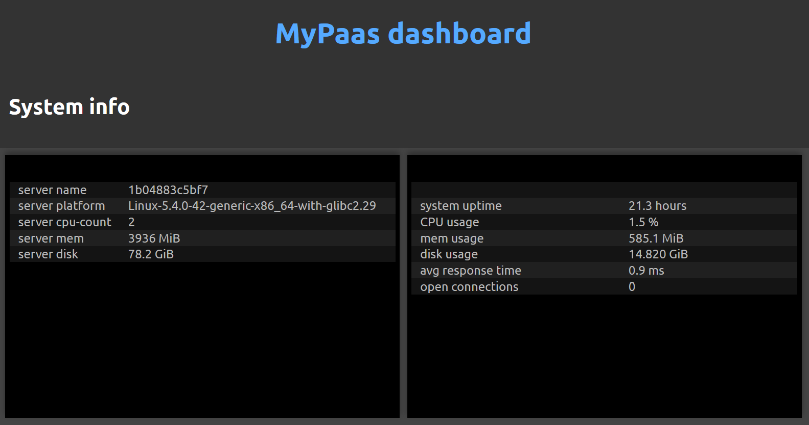
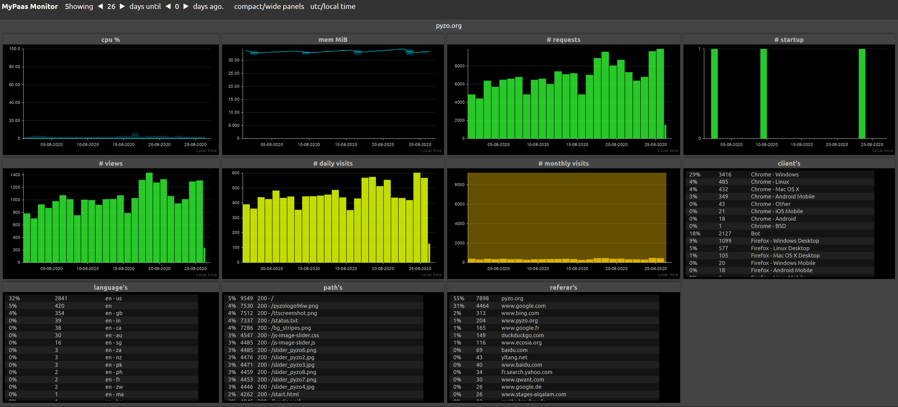

</img>
</img>

# MyPaas
Run your own PaaS using Docker, Traefik, and great monitoring

MyPaas is a tool that makes it easy to run a platform as a service (PaaS)
on your own VM or hardware. It combines Traefik and Docker, offers free
automatic https, secure (zero-downtime) deployments via dockerfiles, and analytics.

You can setup your PaaS and make your first deployment in about 5 minutes.

## Docker plus Traefik is awesome

[Docker](https://en.wikipedia.org/wiki/Docker_(software)) makes it
possible to run multiple applications on a single server in a contained
way.

[Traefik](https://traefik.io/) is a modern router, reverse proxy, and
load balancer that can be automatically configured using labels on
Docker containers. It can also act as an https endpoint and
automatically refreshes SSL/TLS certificates with [Let's Encrypt](https://letsencrypt.org/).

[MyPaas](https://github.com/almarklein/mypaas) is a tool that helps you
setup Traefik, and deploy Docker containers that have the right labels
so that Traefik handles them in the right way. Plus it adds
powerful analytics for all your apps. Website traffic is logged
server-side, without cookies, respecting the end user's privacy.

I use MyPaas myself to serve e.g. https://pyzo.org and https://timetagger.app.

## How it works

MyPaas is a command line interface (CLI) to setup and manage your PaaS server.
You use the same CLI on your work machine to push deploys to the server.
You configure your service/app by writing a Dockerfile and adding special
mypaas-comments to it, and push that to the server via the CLI, where it is built
and deployed. There is a web dashboard, but only for viewing status and analytics.

## Setting expectations

Using MyPaas requires you to be familiar with a few basic backend
development skills. There are plenty of online guides on each topic.

* You must be able to SSH into your server.
* You must know how to edit a file over SSH.
* You should probably know the basics of Docker.
* It may be useful to know the basic commands of systemctl
  (actually, `systemctl status mypaasd` may be all you need).

## Guide

* [Getting started](docs/gettingstarted.md)
* [Deploying](docs/deploying.md)
* [Checking status and analytics](docs/status.md)
* [The CLI](docs/cli.md)
* [Notes on security](docs/security.md)

Also see the [example services](https://github.com/almarklein/mypaas/tree/main/example_services).

## License

BSD 2-clause.

## What about serverless?

Serverless is nice and often very affordable, but you give up control
and you often need additional services for analytics, databases, etc.
MyPaas tries to make managing your server as easy as possible. You
remain in control, and your only costs are that of the VM that the PaaS
runs on.

## Alternative projects to run your own PaaS

There are several tools similar to MyPaas. This is how (I think) they
differ (let me know via an issue or PR if you can explain
the differences better, or know of another alternative project.)

* [Dokku](http://dokku.viewdocs.io/dokku) uses Docker and Nginx. Apps
  are configured at the server (rather than via the dockerfile as MyPaas does).
  At the time that I tried it, getting Let's Encrypt to work was not trivial,
  but this may have changed. Docku has no builtin analytics. Deploys
  go via a `git push`, as opposed to a a push command of a CLI tool
  (`mypaas push`).
* [CapRover](https://caprover.com) uses Docker and Nginx, and has a
  nice web UI. This is also its weak spot IMO, because a username
  and password are all that's needed to give full access to your apps.
  MyPaas uses RSA keys and tokens that time out to provide high security.
* [Swarmpit](https://swarmpit.io/) uses Docker Swarm and comes with monitoring.
  It's probably a bit more down to the metal. Not sure if it does Let's Encrypt?
* [SwarmLet](https://swarmlet.dev/) uses Traefik and Docker compose /
  Docker swarm. This project is probably closest to MyPaas. It uses raw
  labels for Traefik added in the compose file to configure an app.
  MyPaas uses more high-level configuration in the Dockerfile. Swarmlet
  uses git push to make a deploy as opposed to `mypaas push`.

