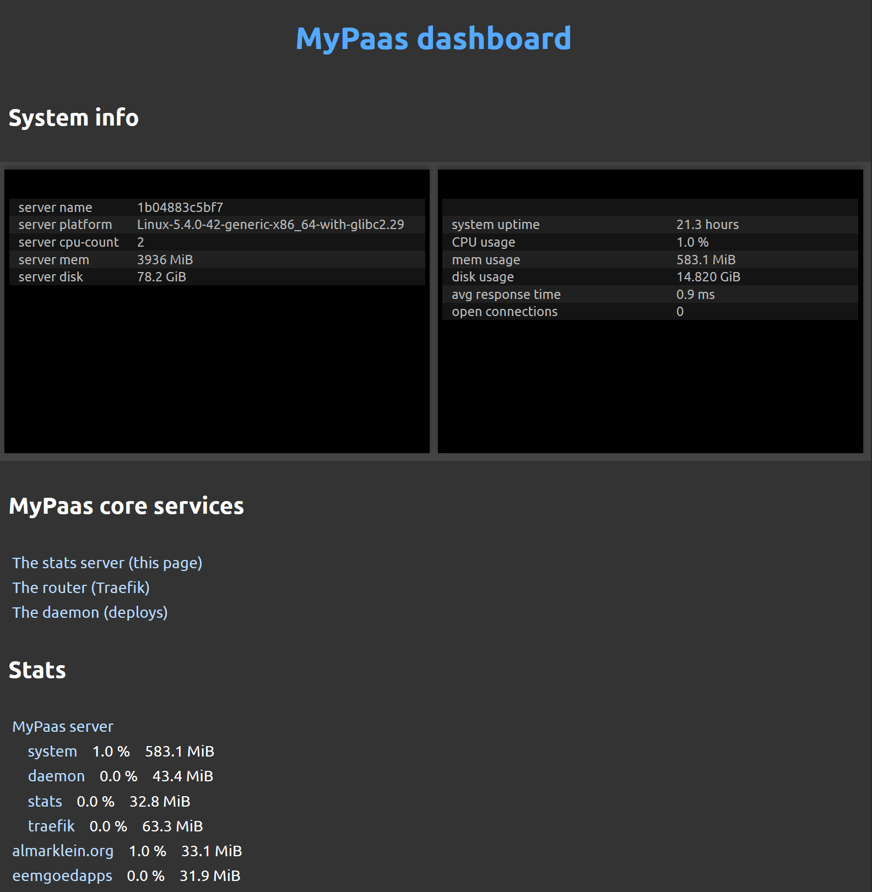

# Checking the status and analytics

Simply go to the url that you set during `mypaas server init`.
This will provide an overview page with the status of the system and
its services.

From the main page you can inspect the three parts that MyPaas consists of:

* The Treafik router (acting as a reverse proxy and https endpoint).
* The stats server (display status and analytics).
* The daemon (performing deployments).

Screenshot of the dashboard: 
</img>
  

Screenshot of a website stats: 
</img>
